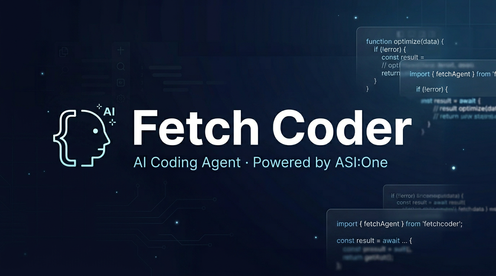

<div align="center">



# 🚀 Fetch Coder

**Your autonomous AI coding partner — right inside VS Code**

[](https://marketplace.visualstudio.com/items?itemName=gautammanak2.fetch-coder)
[](LICENSE)
[](https://asi1.ai)
[](https://discord.gg/fetchai)
[](https://github.com/gautammanak1/asi1-vs-code/releases/tag/v0.2.13)

<p>Write code, debug, edit files, run commands — all conversationally with your AI partner.</p>

<p align="center"><sub>Current extension version: <strong>0.2.13</strong> · Git tag: <a href="https://github.com/gautammanak1/asi1-vs-code/releases/tag/v0.2.13"><code>v0.2.13</code></a></sub></p>

</div>

---

## 🎯 What is Fetch Coder?

Fetch Coder is an **autonomous AI coding agent** integrated into VS Code, powered by **asi1.ai**. It works like having a senior engineer sitting beside you—understanding your codebase, writing code, debugging issues, running commands, and iterating until the job is done.

### Perfect for:
- 🏗️ Building full-stack applications from scratch
- 🐛 Debugging complex issues across your codebase
- 📝 Refactoring and optimizing code
- 🔧 DevOps tasks (Docker, Kubernetes, CI/CD)
- 🤖 Creating autonomous agents and AI systems
- 📚 Learning new frameworks and technologies

---

## ⚡ Quick Start

### 1️⃣ Install

Search **"Fetch Coder"** in VS Code Extensions, or [install from VS Code Marketplace](https://marketplace.visualstudio.com/items?itemName=gautammanak2.fetch-coder).

### 2️⃣ Get API Access

1. Visit **[asi1.ai/dashboard](https://asi1.ai/dashboard)**
2. Create an API key
3. Paste it in Fetch Coder's welcome screen

### 3️⃣ Start Building

Open the Fetch Coder sidebar and describe what you need:

```
"Create a modern landing page with animations and dark mode"
"Build a REST API with authentication and database"
"Debug my React app's performance issues"
"Write tests for my Python module"
"Set up Docker, GitHub Actions, and deployment"
```

---

## ✨ Features

### 💬 **Intelligent Chat**
Chat with asi1.ai naturally. It understands your code, explains problems, suggests improvements, and executes changes—all in real-time with streaming responses.

### 🎨 **Beautiful Welcome Screen**
- **asi1.ai logo & branding** prominently displayed
- Gradient text headers with modern design
- Quick-start suggested tasks with icons
- Get started immediately with pre-built examples
- Settings quick access for prompt customization

### 📝 **Smart Code Generation**
- Write new features
- Fix bugs automatically
- Refactor existing code
- Generate tests and documentation
- Create full applications

### 🗂️ **File Management**
- Read and analyze files
- Create new files and folders
- Modify multiple files at once
- See diffs before applying changes
- Auto-rollback if something breaks

### 💻 **Terminal Integration**
Run any terminal command and read output:
- `npm install`, `git commit`, `docker build`
- Python, Node.js, bash scripts
- Database migrations
- Long-running processes with streaming output

### 🔍 **Web Search**
Toggle the **globe icon** to enable real-time web search. Fetch Coder can research current best practices, APIs, and solutions while coding.

### ✨ **Prompt Enhancement**
Click the **sparkles icon** to let ASI:One rewrite your prompt for better results with more details and clarity.

### 📊 **Plan & Act Modes**
- **Plan Mode**: Analyze the problem, gather info, design a solution
- **Act Mode**: Execute changes immediately

Toggle with the **Plan/Act** switch in the chat input.

### 🔌 **MCP Server Support**
Connect to specialized tools and services via [Model Context Protocol](https://spec.modelcontextprotocol.io/):
- Databases (PostgreSQL, MongoDB, etc.)
- APIs and integrations
- Custom tools and services
- Real-time data access

### 💾 **Checkpoints & History**
- Auto-save checkpoints before changes
- Revert to any previous state
- Full task history with search
- Resume interrupted conversations

### 🤖 **Subagents**
For complex tasks, spawn parallel subagents to work on different parts simultaneously—faster development.

### 🌐 **Browser Automation**
Automated testing and interaction:
- Launch headless browser
- Navigate and click elements
- Fill forms, submit data
- Verify UI changes

---

## 🛠️ Configuration

### API Key Setup (Choose one)

**Option 1: Welcome Screen** (Recommended)
- Paste when Fetch Coder first opens

**Option 2: Command Palette**
```
Cmd+Shift+P → "Fetch Coder: Set API Key"
```

**Option 3: VS Code Settings**
```json
{
  "fetchCoder.apiKey": "your-api-key-here"
}
```

**Option 4: Environment Variable**
```bash
export ASI_ONE_API_KEY="your-api-key-here"
```

### Model & Endpoint
- **Model**: `asi1`
- **Endpoint**: `https://api.asi1.ai/v1`
- **Auto-configured**: No manual setup needed

### Privacy & Security
- Your code stays on your machine
- API calls go directly to asi1.ai
- No telemetry or tracking
- All settings encrypted

---

## ⌨️ Keyboard Shortcuts

| Shortcut | Action |
|----------|--------|
| `Cmd + '` | Add selected code to chat / Focus chat |
| `Cmd + Shift + A` | Toggle Plan/Act mode |
| `Cmd + K` | Search history |
| `Cmd + Shift + P` | Open Command Palette |

---

## 🎨 Toolbar Guide

| Button | Function |
|--------|----------|
| **@** | Add context (files, folders, screenshots) |
| **+** | Attach files or images |
| **🌐** | Toggle web search |
| **🔌** | Configure MCP servers |
| **✨** | Enhance prompt with AI |
| **📤** | Send message |

---

## 📦 Installation from Source

```bash
# Clone repository
git clone https://github.com/gautammanak1/asi1-vs-code.git
cd asi1-vs-code

# Install dependencies
npm install
cd webview-ui && npm install && cd ..

# Build
npm run protos
npm run build:webview
npm run compile

# Launch (press F5)
# Opens VS Code Extension Development Host
```

---

## 🔗 Resources

| Resource | Link |
|----------|------|
| **Website** | [asi1.ai](https://asi1.ai) |
| **Dashboard** | [asi1.ai/dashboard](https://asi1.ai/dashboard) |
| **API Docs** | [docs.asi1.ai](https://docs.asi1.ai) |
| **GitHub** | [gautammanak1/asi1-vs-code](https://github.com/gautammanak1/asi1-vs-code) |
| **Agentverse** | [agentverse.ai](https://agentverse.ai) |
| **Fetch.ai Docs** | [innovationlab.fetch.ai](https://innovationlab.fetch.ai) |
| **Support** | [Discord Community](https://discord.gg/fetchai) |

---

## 📄 License

Apache License 2.0 — see [LICENSE](LICENSE) for details.

---

<div align="center">

**Built with ❤️ by [Gautam Manak](https://github.com/gautammanak1)**

**Powered by [asi1.ai](https://asi1.ai) — The future of autonomous coding**

[⬆ Back to top](#-fetch-coder)

</div>
