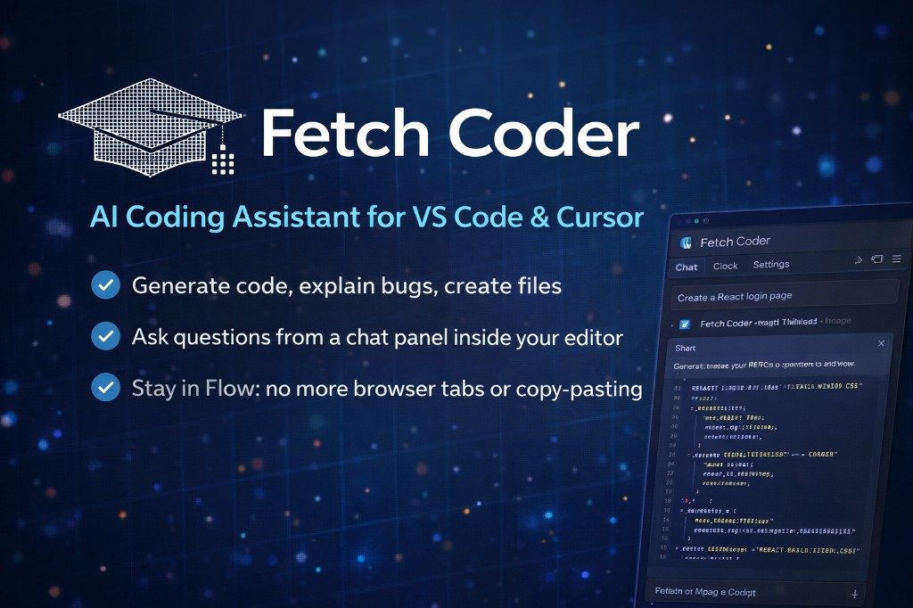

<div align="center">



# Fetch Coder

### AI Coding Assistant for VS Code & Cursor · **v0.1.7**

<p align="center">
  <a href="https://marketplace.visualstudio.com/items?itemName=gautammanak2.fetch-coder">
    
  </a>
  <a href="./LICENSE">
    
  </a>
  <a href="https://code.visualstudio.com/">
    
  </a>
  <a href="https://github.com/gautammanak1/asi1-vs-code/actions/workflows/ci.yml">
    
  </a>
  <a href="https://api.asi1.ai/">
    
  </a>
  <a href="https://www.fetch.ai/">
    
  </a>
  <a href="https://github.com/gautammanak1/asi1-vs-code/releases/tag/v0.1.7">
    
  </a>
</p>

<p align="center">
  Build faster with AI directly inside your editor.<br/>
  Generate code, explain bugs, create files, and ship without leaving VS Code.
</p>

</div>

---

## Overview

Fetch Coder is an AI-powered coding assistant built for **VS Code** and **Cursor** using the **ASI1 API**.

It gives you a fast, clean **sidebar chat** so you can:

- Generate code and create project files  
- Fix errors with inline edits (Cmd+I / Ctrl+I)  
- Explain functions and debug issues  
- Auto-apply generated files to your workspace  
- Run terminal commands directly from chat  
- Get follow-up suggestions after every response  
- Stream AI responses in real time  
- Use **tool calling** (workspace read/write/search + terminal) and **web search**  

Instead of switching between tabs, websites, and separate tools, you can stay in the IDE.

---

## Why this exists

Building with **ASI1** should not mean juggling browser tabs and copy-pasted snippets. This extension keeps chat, tools, and web search in one place.

---

## Who is this for?

- Developers who want **ASI1** inside the editor.  
- Developers building with LLM APIs who want prompt + code + files in one sidebar flow.

---

## Features (at a glance)

| Area | What you get |
|------|----------------|
| **Chat** | Sidebar panel, streaming, Markdown, syntax-highlighted code, follow-up suggestions |
| **Inline Edit** | Cmd+I / Ctrl+I for targeted code edits with language context |
| **Auto Apply** | Generated files are automatically written to your workspace |
| **Terminal** | AI can execute shell commands (npm, git, node, etc.) directly |
| **Workspace** | Tools to read/write files, glob-search, and run terminal commands |
| **Web** | `web_search` via ASI1 (when enabled) |
| **Files** | Fenced code + “Save as” hints; optional auto-apply |
| **Image** | Image generation via chat (`/v1/image/generate`) |

### AI chat inside VS Code

Ask anything from the sidebar chat panel.

```txt
Create a React login page
Fix this TypeScript error
Explain this API response
Generate a Tailwind navbar
```

### Streaming responses

Replies stream in as the model generates them (when streaming is enabled and tools are not resolving a multi-step tool loop).

### Code highlighting

Markdown and syntax-highlighted code blocks for easier reading.

### Ask about selected code

Highlight code and run **ASI: Ask About Selection** to explain, debug, or improve it.

### File generation

Generated files can be written into your workspace (manual **Create files** or optional **auto apply**).

### Auto apply files

Optional: automatically create files detected from the assistant reply (requires an open folder).

### Chat UI & optional branding

The sidebar uses a **minimal black** theme with a **Fetch Coder** label, session id, and turn count. Optional `asiAssistant.banner*` and link settings remain in configuration (compatibility / future use).

### Tools & web search (ASI1)

When enabled in settings, requests can include **workspace tools** and/or **`web_search`** per ASI:One / OpenAI-compatible behavior.

## Preview

<div align="center">


</div>

---

## Installation

### From VS Code Marketplace

Install from the Marketplace:

```txt
https://marketplace.visualstudio.com/items?itemName=gautammanak2.fetch-coder
```

Or open: [Fetch Coder — Visual Studio Marketplace](https://marketplace.visualstudio.com/items?itemName=gautammanak2.fetch-coder)

### Cursor Marketplace / Open VSX

Cursor relies on Open VSX style listings for discoverability.  
If the extension is visible in VS Marketplace but not in Cursor search, publish the same version to Open VSX as well.

### From a `.vsix` file

```bash
npm install
npm run compile
npm run package
```

Then install:

```bash
code --install-extension ./fetch-coder-0.1.7.vsix
```

Or:

- Open **Extensions** in VS Code  
- Click the **…** menu  
- Choose **Install from VSIX…**  
- Select the generated `.vsix` file  

---

## Getting started

### 1. Set your API key

You can configure your ASI1 API key in several ways:

#### Command Palette

```txt
ASI: Set API Key
```

#### VS Code settings

```json
"asiAssistant.apiKey": "your_api_key"
```

#### Environment variable

```bash
export ASI_ONE_API_KEY=your_api_key
```

#### Local dev (optional)

A file named `.api-key` next to the extension folder (development only).

---

### 2. Open the chat panel

- Use the **Activity Bar** → **Fetch Coder** → **Chat**, or  
- Command Palette: **`ASI: Open Assistant Chat`**

**Shortcut:**

```txt
Ctrl + Shift + ;
Cmd + Shift + ;   (Mac)
```

---

## Commands

| Command | Description |
|---------|-------------|
| `ASI: Open Assistant Chat` | Open / focus the chat panel |
| `ASI: Ask About Selection` | Ask about selected code (or file) |
| `ASI: Set API Key` | Save your API key securely |
| `ASI: Install Extension from .vsix` | Install extension from a `.vsix` file |

---

## Extension settings

All settings use the `asiAssistant.*` prefix.

| Setting | Description |
|---------|-------------|
| `asiAssistant.apiKey` | ASI1 API key |
| `asiAssistant.baseUrl` | Chat completions endpoint URL |
| `asiAssistant.model` | Model id (e.g. `asi1`) |
| `asiAssistant.imageBaseUrl` | Optional image API base URL (empty = derive from chat URL) |
| `asiAssistant.imageModel` | Image model id (empty = fallback to chat model) |
| `asiAssistant.imageSize` | Default image size (e.g. `1024x1024`) |
| `asiAssistant.systemPrompt` | System message for every request |
| `asiAssistant.streamResponse` | Stream SSE (off while built-in tools resolve a turn) |
| `asiAssistant.webSearch` | Enable ASI1 `web_search` |
| `asiAssistant.enableTools` | Workspace read + glob search via tool calling |
| `asiAssistant.agenticSession` | Send `x-session-id` for agentic flows |
| `asiAssistant.sessionId` | Optional fixed session id |
| `asiAssistant.maxToolRounds` | Max tool-call rounds per message |
| `asiAssistant.autoApplyFiles` | Auto-write detected files after replies |
| `asiAssistant.bannerTitle` | Optional banner title (setting retained) |
| `asiAssistant.bannerSubtitle` | Optional banner subtitle (setting retained) |
| `asiAssistant.bannerLogoUrl` | Optional HTTPS logo URL (setting retained) |
| `asiAssistant.linkWebsite` | Website URL |
| `asiAssistant.linkDocs` | Documentation URL |
| `asiAssistant.linkX` | X (Twitter) URL |
| `asiAssistant.linkCommunity` | Community URL |
| `asiAssistant.linkResources` | Resources URL |
| `asiAssistant.linkSupport` | Support URL |
| `asiAssistant.linkContact` | Contact URL |

---

## Example use cases

### Frontend development

- Create React components  
- Generate Tailwind UI  
- Debug CSS issues  
- Build forms and pages  

### Backend development

- Generate Express routes  
- Create APIs  
- Build database schemas  
- Write authentication logic  

### Debugging

- Fix TypeScript errors  
- Explain stack traces  
- Understand console errors  
- Improve code quality  

### Learning

- Explain code line by line  
- Learn frameworks faster  
- Understand new libraries  
- Get examples instantly  

---

## Project structure (this repository)

```text
asi1-vs-code/
├── src/
│   ├── extension.ts           # activation, commands
│   ├── chatViewProvider.ts    # webview chat UI
│   ├── asiClient.ts           # ASI1 API, tools, web_search
│   └── workspaceFiles.ts      # extract/write files from replies
├── media/                     # chat.css, chatPanel.js, markdown + highlight
├── resources/
│   ├── icon.png, logo.png, readme-banner.png
├── package.json
├── README.md
├── README.vsix.md             # Marketplace readme (VSIX packaging)
├── CHANGELOG.md
├── CONTRIBUTING.md
├── SECURITY.md
└── LICENSE
```

---

## Documentation links

| Resource | URL |
|----------|-----|
| ASI1 API | [api.asi1.ai](https://api.asi1.ai/) |
| Fetch.ai | [fetch.ai](https://www.fetch.ai/) |
| ASI:One docs | [docs.fetch.ai](https://docs.fetch.ai) (tool calling, web search, OpenAI compatibility) |

---

## Development

Clone the repository:

```bash
git clone https://github.com/gautammanak1/asi1-vs-code.git
cd asi1-vs-code
```

Install dependencies:

```bash
npm install
```

Compile:

```bash
npm run compile
```

Run the extension locally:

```txt
Press F5 inside VS Code (Extension Development Host)
```

Optional watch mode:

```bash
npm run watch
```

Package Extension:

```bash
npm run package
```

This **`README.vsix.md`** file is what ships as the Marketplace long description when you run **`npm run package`** (`vsce package --readme-path README.vsix.md`) — **v0.1.3** includes the icon + banner above. The same content is kept in **`README.md`** on GitHub.

---

## Troubleshooting

- `DeprecationWarning: punycode module is deprecated` from Cursor Helper/Plugin is a Node/runtime warning and usually not a functional extension failure.
- If install/search fails in Cursor, install via VSIX as a fallback and ensure Open VSX publish is completed for that exact version.

---

## What's new in v0.1.7

- Fixed Open VSX publishing: improved namespace creation workflow  
- CI/CD reliability improvements for Marketplace and Open VSX  

## Roadmap

- Multi-file diff review flow  
- Chat history export/import  
- More model options where the API supports them  
- VS Code native chat participant (requires VS Code 1.93+)  

---

## Contributing

Contributions are welcome.

1. Fork the repository  
2. Create a new branch  
3. Make your changes  
4. Commit your work  
5. Open a pull request  

Please read **[CONTRIBUTING.md](./CONTRIBUTING.md)** for setup, checks, and PR expectations.  
See **[CHANGELOG.md](./CHANGELOG.md)** for release notes.

---

## Security

Found a security issue? Please read **[SECURITY.md](./SECURITY.md)** instead of opening a public issue.

---

## License

This project is licensed under the **MIT License**.  
See **[LICENSE](./LICENSE)** for full text.

---

<div align="center">

### Built with ❤️ by Gautam Manak

If you like this project, give it a ⭐ on GitHub.

</div>
