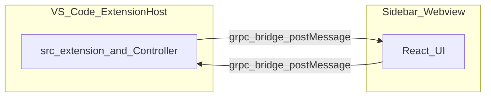

# Architecture (high level)

Fetch Coder splits work between the **VS Code extension host** (Node) and an embedded **React webview**. User actions in the sidebar send **Proto/protobuf-oriented messages** to the backend controller; replies stream back without claiming integration with Cursor’s built-in AI chat pane.

Further detail on motivation and workflows for agent-style assistants lives in **[architecture/AI_CODING_ASSISTANT.md](architecture/AI_CODING_ASSISTANT.md)**.

## Component diagram

Key entrypoints to read in source:

- Sidebar registration: **`src/hosts/vscode/VscodeWebviewProvider.ts`** (resolves the webview, wires `onDidReceiveMessage` → **`handleWebviewMessage`**, posts responses).
- RPC handling: **`src/core/controller/grpc-handler.ts`** (unary + streaming helpers posting **`grpc_response`** messages).
- Aggregate controller orchestration: **`src/core/controller/index.ts`**.

This document is intentionally short; deep diagrams should stay next to code or in **[architecture/AI_CODING_ASSISTANT.md](architecture/AI_CODING_ASSISTANT.md)** to reduce drift.

